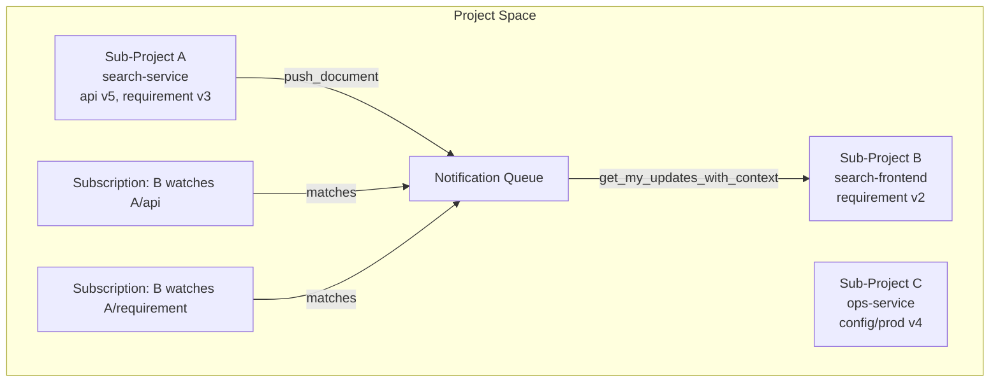
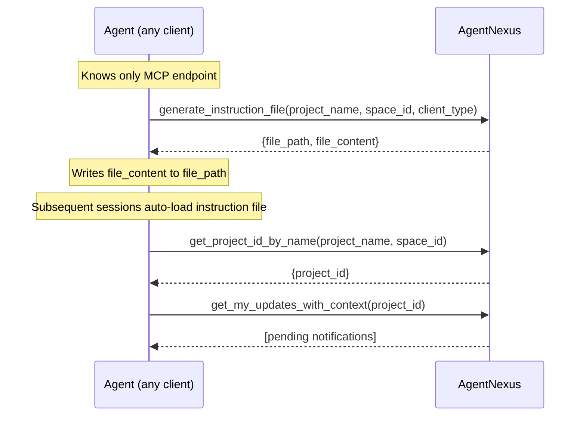
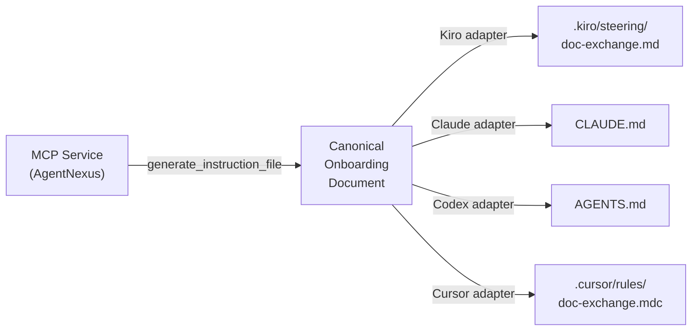
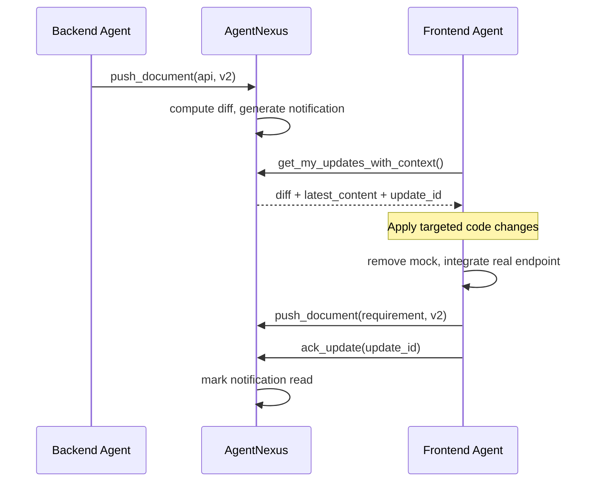

# AgentNexus: A Service-Boundary-Aware Coordination Architecture for Heterogeneous LLM Code Agents

**dugubuyan**
Independent Researcher
GitHub: [github.com/dugubuyan](https://github.com/dugubuyan) · X: [@dugubuyan](https://x.com/dugubuyan)

*June 2026*

**Keywords**: multi-agent systems, LLM agents, software engineering, service-oriented architecture, publish-subscribe, Model Context Protocol, lifecycle management, agent onboarding protocol

---

## Abstract

Existing multi-agent software development frameworks such as ChatDev and MetaGPT organize agents around *roles* (product manager, developer, tester) within a single simulated organization. While effective for monolithic tasks, this role-playing paradigm breaks down in real-world polyglot systems where multiple independently-deployed services—each maintained by its own LLM agent—must coordinate across service boundaries. We present **AgentNexus**, a document exchange center that coordinates heterogeneous code agents at the *service* granularity rather than the role granularity. AgentNexus introduces four key ideas: (1) a versioned Markdown document store with publish-subscribe notification, enabling agents to detect and respond to cross-service changes; (2) an explicit lifecycle stage model that tracks each service's development phase as a first-class entity, replacing ad-hoc role-playing with structured state transitions; (3) a diff-aware update protocol that delivers structured change summaries alongside full document context, allowing downstream agents to perform targeted code modifications; and (4) a **Service-Driven Agent Onboarding Protocol (SDAOP)**, a formal abstraction over existing agent instruction file formats (AGENTS.md, CLAUDE.md, Kiro steering, Cursor rules), enabling MCP services to dynamically generate and deliver client-specific onboarding context at connection time rather than requiring manual configuration. We describe the architecture, implementation, and an initial deployment coordinating a backend search service and its frontend management console. Our results suggest that grounding multi-agent coordination in service-level document exchange—rather than simulated organizational roles—better reflects the structure of real software systems and reduces coordination overhead.

---

## 1. Introduction

The past two years have seen rapid progress in LLM-based multi-agent systems for software engineering. Pioneering frameworks such as ChatDev [Qian et al., 2024] and MetaGPT [Hong et al., 2024] demonstrated that a collection of role-playing agents—simulating product managers, architects, developers, and testers—can autonomously produce working software from natural-language requirements. These systems adopt a *role-centric* coordination model: agents are assigned human organizational roles, and coordination happens through simulated meetings, code reviews, and document handoffs within a single shared context.

This role-centric model has a fundamental mismatch with real-world software development at scale. Production systems are not monolithic; they are composed of multiple independently-deployed services, each with its own codebase, technology stack, and development team. When a backend API changes, the frontend must adapt. When a shared configuration changes, every dependent service must update. These cross-service dependencies are not captured by role assignments—they are captured by *service boundaries and the documents that cross them*.

We observe that the core coordination problem in multi-service development is not "which role should handle this task" but rather "which service needs to know about this change, and what exactly changed." This reframing leads us to a fundamentally different architecture.

We present **AgentNexus**, a document exchange center that acts as the coordination substrate for a collection of LLM code agents, each responsible for a distinct service. AgentNexus makes four contributions:

1. **Service-granular coordination**: Each agent is registered as a *sub-project* with its own document namespace. Documents (requirements, design, API specs, configuration) are versioned and stored per service. Agents subscribe to documents from other services they depend on.

2. **Lifecycle stage as a first-class entity**: Rather than simulating organizational roles, AgentNexus tracks each service's development lifecycle stage (design → development → testing → deployment → upgrade) as a persistent, queryable attribute. Stage transitions trigger milestone snapshots and cross-service notifications, grounding coordination in the actual state of the system.

3. **Diff-aware update protocol**: When a subscribed document changes, the one-call API `get_my_updates_with_context` delivers both a structured diff (unified diff format) and the full latest document. This allows downstream agents to perform targeted, context-aware code modifications rather than full re-reads.

4. **Service-Driven Agent Onboarding Protocol (SDAOP)**: A formal protocol layer that allows the MCP service itself to generate and deliver client-specific onboarding documents at connection time, eliminating the need for manual configuration of agent instruction files across heterogeneous IDE clients.

---

## 2. Background and Related Work

### 2.1 Role-Playing Multi-Agent Frameworks

ChatDev [Qian et al., 2024] organizes agents as CEO, CTO, programmer, and tester, coordinating through a "chat chain" of sequential dialogues. MetaGPT [Hong et al., 2024] introduces Standardized Operating Procedures (SOPs) and assigns agents roles such as product manager and QA engineer, producing structured artifacts in a waterfall-style pipeline. ALMAS [2025] extends this to agile workflows with sprint planning and code review agents.

These frameworks share a common assumption: all agents operate within a single simulated organization on a single codebase. Coordination is achieved through shared context and role-based task delegation.

A concurrent work also named AgentNexus [concurrent work] focuses on accelerating AI agent development and enhancing interoperability through MCP as a protocol layer. In contrast, our work addresses a complementary problem: how to coordinate heterogeneous LLM code agents across *service boundaries* in multi-service software systems, treating the service—not the agent role—as the fundamental unit of coordination.

### 2.2 Limitations of the Role-Centric Model

He et al. [2024] identify several open challenges in LLM-based multi-agent software engineering, including context window limitations, agent misalignment, and the difficulty of managing long-horizon tasks. E2EDev [2025] benchmarks show that multi-agent frameworks do not consistently outperform single-agent approaches, partly due to coordination overhead.

A deeper limitation, less discussed in the literature, is *organizational boundary mismatch*. Real software systems are not single organizations—they are ecosystems of services. The role-playing metaphor forces a flat organizational structure onto what is inherently a distributed, service-oriented architecture. When a backend developer agent and a frontend developer agent are both "developers" in the same simulated company, there is no natural mechanism to enforce service boundaries, version contracts, or change propagation.

### 2.3 Publish-Subscribe for Agent Coordination

The publish-subscribe pattern [Eugster et al., 2003] is well-established in distributed systems for decoupling producers from consumers. Recent work on agent interoperability protocols, including MCP [Anthropic, 2024] and A2A [Google, 2025], has begun to apply similar ideas to agent communication. AgentNexus extends this pattern specifically to *document-level* coordination in software development, where the "messages" are versioned Markdown documents representing service contracts.

### 2.4 Agent Instruction File Formats

A number of formats have emerged for injecting workflow context into LLM agents: AGENTS.md [AAIF, 2025], CLAUDE.md [Anthropic, 2025], Kiro steering files, and Cursor rules are the most widely adopted. In December 2025, AGENTS.md was donated to the Agentic AI Foundation (AAIF) under the Linux Foundation, signaling a push toward standardization.

All existing formats share a common model: a human author writes a static Markdown file, commits it to the repository, and the IDE agent loads it at startup. This approach works well for stable, single-project conventions. It does not address the case where an external service—rather than a human—needs to inform an agent how to interact with it. SDAOP (Section 3.5) fills this gap.

A recent work also named AgentNexus [Jung & Hamilton, 2026] presents a centralized platform for accelerating AI agent development with pre-built toolkits and MCP integration, targeting rapid deployment of multi-agent workflows. Our work addresses a complementary problem: coordinating heterogeneous LLM code agents across service boundaries in multi-service software systems, using versioned document exchange rather than a centralized agent runtime.

---

## 3. Architecture

### 3.1 Core Abstractions

AgentNexus organizes the world around four abstractions:

**Figure 1** shows the overall system structure. A Project Space contains multiple Sub-Projects (services), each owning a set of versioned Documents. Subscriptions connect sub-projects across service boundaries, and the notification queue delivers change events to subscribers.



*Figure 1: AgentNexus data model. Sub-projects own documents; subscriptions define cross-service dependencies; notifications propagate changes to subscribers.*

**Project Space**: The top-level isolation unit, corresponding to a large project or product. All sub-projects, documents, and subscriptions belong to a space.

**Sub-Project**: A registered service or component, identified by a UUID `project_id`. Each sub-project has a name, type (development, testing, ops, infra), and lifecycle stage.

**Document**: A versioned Markdown artifact belonging to a sub-project. Documents are typed: `requirement`, `design`, `api`, `config`, `schema`, `runbook`, `changelog`, or `task`. Each push creates a new version; content is deduplicated by SHA-256 hash.

**Subscription**: A rule declaring that sub-project A should be notified when a specific document (or document type) from sub-project B changes.

### 3.2 Lifecycle Stage Model

Each sub-project carries a `stage` attribute drawn from a fixed vocabulary: `design`, `development`, `testing`, `deployment`, `upgrade`. Stage transitions are explicit operations that:

1. Update the sub-project's stage and record the transition timestamp.
2. Automatically create *milestone snapshots*—immutable copies of all published documents at the moment of transition.
3. Generate stage-switch tasks for affected sub-projects.

This model differs fundamentally from role-playing frameworks. Rather than assigning an agent the *role* of "tester," AgentNexus records that a service is *in the testing stage*. The distinction matters: a service can be in the testing stage while its dependent frontend is still in development. The stage is a property of the service, not of an agent persona.

### 3.3 Diff-Aware Update Protocol

When a subscribed document is updated, AgentNexus generates a notification containing the new version number. When an agent calls `get_my_updates_with_context`, the system returns, for each unread notification:

- `diff`: A unified diff between the previous and current version, computed server-side using Python's `difflib`.
- `latest_content`: The full text of the current version.
- `doc_type`: The document type, enabling agents to route updates to appropriate handlers.

This design reflects a key insight: agents need both *what changed* (to perform targeted modifications) and *the full current state* (to maintain correct context). Providing only the diff risks missing context; providing only the full document makes it difficult to identify the locus of change.

### 3.4 MCP Interface

AgentNexus exposes its functionality as a Model Context Protocol server running in streamable-HTTP mode, allowing multiple agents to connect simultaneously. The tool set is divided into:

**Agent tools**: `push_document`, `patch_document`, `get_document`, `get_my_updates_with_context`, `ack_update`, `get_my_tasks`, `get_config`

**Admin tools**: `create_space`, `register_project`, `list_projects`, `add_subscription`, `publish_draft`, `generate_instruction_file`, `get_project_id_by_name`, `list_documents`

### 3.5 Service-Driven Agent Onboarding Protocol

When a new agent connects to AgentNexus, it faces a bootstrapping problem: it knows the MCP endpoint but has no knowledge of the project's coordination conventions, document naming scheme, or required workflow steps. Existing solutions—AGENTS.md [AAIF, 2025], CLAUDE.md [Anthropic, 2025], Kiro steering files—address this by having humans manually author a static instruction document and commit it to the repository. This approach has two limitations: the document is maintained out-of-band from the service it describes, and it must be independently authored for each client tool's format.

AgentNexus introduces a different approach: the service itself generates and delivers the onboarding document at connection time via the `generate_instruction_file` MCP tool. We formalize this as the **Service-Driven Agent Onboarding Protocol (SDAOP)**.

#### Protocol Definition

SDAOP defines three components:

**1. Canonical Onboarding Document (COD)**

A structured Markdown document with the following required sections:

- **Service Identity**: project_name, project_space_id, MCP endpoint
- **Initialization Workflow**: ordered steps the agent must execute at session start (e.g., resolve project_id, check for pending updates)
- **Document Convention**: doc_id format, doc_type vocabulary, push triggers
- **Update Handling**: how to process notifications — diff interpretation, ack protocol

**2. Client Adapter**

A mapping from COD to the target client's instruction file format and filesystem path:

| Client | Target file | Format notes |
|--------|-------------|--------------|
| Kiro | `.kiro/steering/doc-exchange.md` | Requires `inclusion: auto` YAML frontmatter |
| Claude Code | `CLAUDE.md` | Plain Markdown, no frontmatter |
| Codex / OpenAI | `AGENTS.md` | Plain Markdown, no frontmatter |
| Cursor | `.cursor/rules/doc-exchange.mdc` | Requires YAML frontmatter with `alwaysApply` |

All four formats serve the same functional role—injecting workflow context into the agent's startup context—but differ in file location, frontmatter conventions, and inclusion semantics. The COD provides a single source of truth; the adapter layer handles format divergence.

**3. Delivery Tool**

`generate_instruction_file(project_name, project_space_id, client_type)` — returns the adapted COD content and target path. The agent writes this file to its local workspace; subsequent sessions load it automatically via the client's native mechanism. The onboarding sequence proceeds as follows:



*Figure 3: SDAOP onboarding flow. A single MCP call bootstraps the agent with all coordination knowledge it needs.*

#### Key Distinction from Static Approaches

AGENTS.md and CLAUDE.md solve the problem of *where to store* agent instructions. SDAOP solves the problem of *who authors them and when*. In SDAOP, the MCP service is the authoritative source; the client-specific file is a derived artifact, regenerable on demand. This ensures that as the service evolves (new tools, changed conventions, new document types), agents can refresh their onboarding document by re-calling `generate_instruction_file` rather than requiring a human to update a committed file.



*Figure 4: SDAOP delivery flow. The service generates a canonical document; client adapters serialize it to each tool's native format.*

[^1]: We use the tool-neutral term *agent instruction file* throughout. The concept maps to: *steering file* in Kiro, *rules* in Cursor, `CLAUDE.md` in Claude Code, `AGENTS.md` in Codex/AAIF standard.

---

## 4. Comparison with Role-Centric Frameworks

| Dimension | Role-Centric (ChatDev, MetaGPT) | AgentNexus |
|-----------|--------------------------------|------------|
| Coordination unit | Agent role (developer, tester) | Service (sub-project) |
| Lifecycle tracking | Implicit in workflow phase | Explicit stage per service |
| Change propagation | Shared context / sequential handoff | Pub-sub with versioned diff |
| Service boundaries | Not enforced | First-class namespace per service |
| Multi-codebase support | Single codebase assumed | Native multi-repo |
| Human oversight | Checkpoint prompts | Admin tools + milestone snapshots |
| Context management | Full conversation history | Targeted diff + full doc on demand |
| Agent onboarding | Manual, human-authored | Service-driven via SDAOP |

The key architectural difference is that AgentNexus treats the *service* as the unit of coordination, not the *agent role*. This allows agents to be heterogeneous—different LLMs, different IDEs, different programming languages—as long as they speak the MCP protocol and follow the document exchange contract.

---

## 5. Implementation

AgentNexus is implemented in Python using:

- **FastMCP** (mcp[cli] >= 1.0) for the MCP server layer
- **SQLAlchemy** + **SQLite** for document storage (with a migration path to PostgreSQL)
- **Alembic** for schema migrations
- **watchdog** for filesystem-based document ingestion
- **difflib** for server-side diff computation

The system runs as a single persistent process, exposing the MCP endpoint at `http://0.0.0.0:10086/mcp`. The FileWatcherService monitors a `/docs/` directory, automatically ingesting Markdown files written by agents as draft documents.

The full implementation includes 250 unit and property-based tests using the Hypothesis framework. The source code is available at [https://github.com/dugubuyan/agent-nexus](https://github.com/dugubuyan/agent-nexus). This paper (v3) is archived at [https://doi.org/10.5281/zenodo.20603176](https://doi.org/10.5281/zenodo.20603176); the v2 paper is at [https://doi.org/10.5281/zenodo.19692217](https://doi.org/10.5281/zenodo.19692217).

---

## 6. Initial Deployment

We deployed AgentNexus to coordinate two services in a financial information retrieval system:

- **search-service**: A Python/FastAPI backend providing full-text search over Elasticsearch, with admin endpoints for document review, pipeline monitoring, and sensitive word management.
- **search-admin-frontend**: A React/Ant Design management console consuming the search-service admin APIs.

The frontend sub-project subscribes to the search-service's `api` and `requirement` documents. **Figure 2** illustrates the end-to-end coordination flow when the backend implements a new endpoint.



*Figure 2: End-to-end coordination flow. The backend agent pushes an updated API document; AgentNexus delivers a diff-aware notification; the frontend agent makes targeted code changes and acknowledges.*

When the backend team implements a new endpoint (`PUT /admin/docs/{doc_id}` for in-place document editing), the workflow proceeds as follows:

1. The backend agent updates `search-service/api` via `push_document`.
2. AgentNexus generates a notification for `search-admin-frontend`.
3. The frontend agent calls `get_my_updates_with_context`, receiving the diff showing the new endpoint and the full updated API document.
4. The frontend agent removes the mock implementation and integrates the real endpoint.
5. The frontend agent updates its own `requirement` document to remove the "backend not yet implemented" annotation.
6. The frontend agent calls `ack_update` to mark the notification as read.

This end-to-end flow requires no human coordination beyond the initial subscription configuration.

Both agents were onboarded via SDAOP: each called `generate_instruction_file` once at setup, writing the resulting file to `.kiro/steering/doc-exchange.md`. All subsequent sessions loaded the instruction file automatically, with no manual configuration required.

---

## 7. Discussion

### 7.1 Service Boundary as Coordination Primitive

The central claim of this paper is that *service boundaries*, not *agent roles*, are the appropriate primitive for coordinating LLM agents in real software development. This claim is grounded in the observation that real software systems are already organized around service boundaries—microservices, APIs, configuration contracts—and that the coordination problems that arise in practice (interface drift, configuration mismatch, undocumented changes) are fundamentally cross-service problems.

Role-playing frameworks address a different problem: how to decompose a single development task among multiple agents. AgentNexus addresses the complementary problem: how to keep multiple independently-developed services aligned over time.

### 7.2 Stage as System State

The lifecycle stage model in AgentNexus reflects a view of software development as a *stateful process* rather than a *sequence of role activations*. When a service transitions from development to testing, this is a meaningful event that should trigger downstream actions (milestone snapshots, cross-service notifications, task generation). Encoding this as a first-class system attribute—rather than as a prompt instruction to an agent playing the role of "scrum master"—makes the state observable, queryable, and auditable.

### 7.3 Service-Driven Onboarding as a Protocol Layer

SDAOP represents a new layer in the agent interoperability stack. Current standards—MCP for tool invocation, A2A for peer coordination, AGENTS.md for instruction authoring—all assume that agents arrive pre-configured with knowledge of how to use a service. SDAOP closes this gap by making service onboarding itself a first-class protocol operation.

The analogy is instructive: when a human developer joins a new team, they do not read a role-playing script—they read the project's onboarding documentation, which the project itself maintains. SDAOP applies the same principle to LLM agents, with the service as the authoritative source of onboarding knowledge.

A secondary benefit is *format convergence*. The proliferation of client-specific instruction file formats (CLAUDE.md, AGENTS.md, Kiro steering, Cursor rules) creates maintenance overhead for service authors who wish to support multiple client environments. SDAOP's adapter layer means a service author writes the COD once; the adapters handle format divergence. This is analogous to how OpenAPI separates the API contract from its SDK bindings.

The relationship between SDAOP and existing formats is additive, not competitive. SDAOP does not replace AGENTS.md or CLAUDE.md—it provides a mechanism for services to generate these files programmatically, making them first-class service artifacts rather than manually maintained documentation.

The current AgentNexus implementation supports Kiro as the primary client, deployed and validated in production. Adapter implementations for Claude Code (CLAUDE.md), Codex (AGENTS.md), and Cursor (.cursor/rules/) follow the same COD structure and differ only in frontmatter format and target path. Full validation against each client's live behavior is planned for a subsequent release.

### 7.4 Limitations and Future Work

The current implementation has several limitations. First, the diff-based change detection is purely textual; semantic understanding of what a change *means* for dependent services requires LLM reasoning, which AgentNexus delegates to the consuming agent. Future work could integrate an LLM-based impact analyzer to generate natural-language change summaries alongside the raw diff.

Second, the subscription configuration is currently manual. Future work will automate subscription inference by analyzing design documents to identify cross-service dependencies.

Third, the `patch_document` tool requires clients to supply a well-formed unified diff. In practice, LLM agents cannot reliably hand-author unified diffs for large documents—they are prone to line-number errors. Future work will investigate fuzzy patch application (tolerant of small line-number offsets) and a chunked upload protocol for large documents, keeping large content out of tool-call parameters entirely.

Fourth, the system currently uses SQLite, which limits concurrent write throughput. Migration to PostgreSQL with row-level locking will be necessary for larger deployments.

---

## 8. Conclusion

We have presented AgentNexus v3, a document exchange architecture that coordinates LLM code agents at the service granularity. By treating services—not roles—as the unit of coordination, making lifecycle stage a first-class system attribute, and introducing SDAOP as a protocol layer for service-driven agent onboarding, AgentNexus provides a coordination substrate that better matches the structure of real software systems than existing role-playing frameworks. The diff-aware update protocol enables targeted, context-aware code modifications across service boundaries. SDAOP complements existing agent instruction file standards (AGENTS.md, CLAUDE.md, Kiro steering) by providing a mechanism for services to generate and deliver these files programmatically, eliminating the manual bootstrapping step and enabling format-agnostic client support. We believe this service-boundary-aware approach represents a promising direction for scaling LLM-based software development to real-world polyglot systems.

---

## References

- Qian, C. et al. (2024). ChatDev: Communicative Agents for Software Development. *ACL 2024*.
- Hong, S. et al. (2024). MetaGPT: Meta Programming for A Multi-Agent Collaborative Framework. *ICLR 2024*.
- He, J., Treude, C., Lo, D. (2024). LLM-Based Multi-Agent Systems for Software Engineering: Literature Review, Vision and the Road Ahead. *arXiv:2404.04834*.
- ALMAS (2025). An Autonomous LLM-based Multi-Agent Software Engineering Framework. *arXiv:2510.03463*.
- E2EDev (2025). Benchmarking Large Language Models in End-to-End Software Development Task. *arXiv:2510.14509*.
- Anthropic (2024). Model Context Protocol. *anthropic.com/news/model-context-protocol*.
- Anthropic (2025). Equipping Agents for the Real World with Agent Skills. *anthropic.com/engineering* (Agent Skills post).
- AAIF (2025). AGENTS.md Specification v1.0. Agentic AI Foundation, Linux Foundation. *agentmd.org*.
- Google (2025). Agent2Agent Protocol. *developers.google.com/agent2agent*.
- Eugster, P. et al. (2003). The Many Faces of Publish/Subscribe. *ACM Computing Surveys*.
- Jung, Y., Hamilton, L. (2026). AgentNexus: Accelerating AI Agent Development and Enhancing Interoperability with MCP. *MIT Lincoln Laboratory*.
- RTADev (2025). Intention Aligned Multi-Agent Framework for Software Development. *ACL 2025 Findings*.

---

## Citation

If you find this work useful, please cite:

```bibtex
@misc{dugubuyan2026agentnexusv3,
  author       = {dugubuyan},
  title        = {AgentNexus: A Service-Boundary-Aware Coordination Architecture
                  for Heterogeneous LLM Code Agents (v3)},
  year         = {2026},
  publisher    = {Zenodo},
  doi          = {10.5281/zenodo.20603176},
  url          = {https://doi.org/10.5281/zenodo.20603176},
  note         = {Supersedes v2: doi.org/10.5281/zenodo.19692217}
}
```
