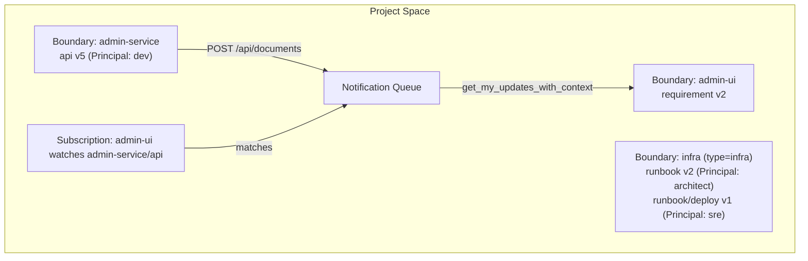

# AgentNexus: A Boundary-Aware Coordination Architecture for Heterogeneous LLM Code Agents

**dugubuyan**
Independent Researcher
GitHub: [github.com/dugubuyan](https://github.com/dugubuyan) · X: [@dugubuyan](https://x.com/dugubuyan)

*July 2026*

**Keywords**: multi-agent systems, LLM agents, software engineering, ownership boundary, publish-subscribe, Model Context Protocol, provenance and attribution, control/data plane separation, agent onboarding protocol

---

## Abstract

Existing multi-agent software development frameworks such as ChatDev and MetaGPT organize agents around *roles* (product manager, developer, tester) within a single simulated organization. Earlier versions of AgentNexus argued that the *service*, not the role, is the natural unit of coordination for real polyglot systems, and coordinated heterogeneous code agents through a versioned document store with publish-subscribe notification. This paper develops that thesis into an operational architecture and reports its first production deployment. First, we generalize the coordination unit from a *service* to an **ownership boundary**: a region of independent consistency responsibility that owns a set of versioned documents. A service is the common case, but infrastructure and test suites are boundaries too. We give an operational criterion—the *subscription litmus test*—for where a boundary is drawn, and we separate *ownership* (singular, the consistency anchor) from *attestation*—a self-attested role, a **Principal**, recorded per write like a Git author—so that many actors collaborate on one boundary without fracturing its ownership. Second, we treat cross-boundary propagation as a *channel* problem rather than a payload problem: document content travels out-of-band over HTTP (a **data plane**, at zero model-token cost) while coordination signals travel over the Model Context Protocol (a **control plane**). The service also delivers client-specific onboarding to each agent at connection time (SDAOP). The same model admits a read-only, boundary-spanning observer—the Planner—which follows from separating ownership from per-write attestation. We report a deployment coordinating eleven boundaries of a commercial multi-service product, in which the Planner surfaced a genuine cross-boundary configuration inconsistency.

---

## 1. Introduction

The past two years have seen rapid progress in LLM-based multi-agent systems for software engineering. Pioneering frameworks such as ChatDev [Qian et al., 2024] and MetaGPT [Hong et al., 2024] demonstrated that a collection of role-playing agents—simulating product managers, architects, developers, and testers—can autonomously produce working software from natural-language requirements. These systems adopt a *role-centric* coordination model: agents are assigned human organizational roles, and coordination happens through simulated meetings, code reviews, and document handoffs within a single shared context.

This role-centric model has a fundamental mismatch with real-world software development at scale. Production systems are not monolithic; they are composed of multiple independently-deployed parts, each with its own codebase, technology stack, and owning team. When a backend API changes, the frontend must adapt. When shared infrastructure changes, every dependent part must update. These dependencies are not captured by role assignments—they are captured by *the boundaries between parts and the documents that cross them*.

Earlier versions of AgentNexus acted on this observation by making the *service* the unit of coordination: each agent was registered with its own document namespace, and services subscribed to the documents of the services they depended on. Deploying this design showed that the useful unit is more general than a service, and that cross-boundary propagation is better addressed at the transport layer than through document diffs. This paper refines the coordination unit and the transport architecture accordingly, and reports the first production deployment.

The unit we take as primitive is the **ownership boundary** (or simply *boundary*): a region of independent consistency responsibility that owns a set of versioned documents. A boundary usually coincides with a service, but need not—an infrastructure area or a test suite owns and versions documents (deployment runbooks, capacity plans, test strategies) without being an independently deployable service. Making the boundary the unit of coordination lets us treat agents as what they are: transient actors that leave attributable traces on durable boundaries.

AgentNexus makes four contributions:

1. **Boundary-granular coordination.** The coordination unit is an ownership boundary, of which a service is the common but not the only instance. We give an operational criterion—the *subscription litmus test* (Section 3.2)—that draws a boundary wherever a contract must be produced by one party and consumed by another, turning an abstract primitive into an engineering test.

2. **Ownership/attestation separation.** We separate *who owns* a boundary (singular, the consistency anchor) from *who acted* on it (plural). The acting role is a **Principal**, recorded per document version much as a Git commit records its author—an annotation, not a registered entity (Section 3.3). This lets several roles collaborate on one boundary without turning it into a multi-owner region, and keeps two concerns out of the coordination core: authentication and authorization (Section 3.4).

3. **Control/data-plane separation.** Coordination and content have different transport needs. Change notifications, subscriptions, and queries ride the Model Context Protocol (the *control plane*); full document content is written out-of-band over HTTP (the *data plane*), incurring zero tokens in any agent's context (Section 3.5).

4. **Service-Driven Agent Onboarding Protocol (SDAOP).** The service itself generates and delivers client-specific onboarding documents at connection time, so a new agent needs only the endpoint to bootstrap (Section 3.6).

Separating ownership from attestation has a further consequence we develop and exercise: because a Principal may hold only *read* attestation and need not be confined to one boundary, the model admits a read-only, boundary-spanning observer—the **Planner** (Section 3.8)—that can answer global questions no single-boundary agent is positioned to answer.

---

## 2. Background and Related Work

### 2.1 Role-Playing Multi-Agent Frameworks

ChatDev [Qian et al., 2024] organizes agents as CEO, CTO, programmer, and tester, coordinating through a "chat chain" of sequential dialogues. MetaGPT [Hong et al., 2024] introduces Standardized Operating Procedures (SOPs) and assigns agents roles such as product manager and QA engineer, producing structured artifacts in a waterfall-style pipeline. ALMAS [2025] extends this to agile workflows with sprint planning and code review agents, and RTADev [2025] aligns agents through a shared intention model. These frameworks share a common assumption: all agents operate within a single simulated organization on a single codebase, and coordination is achieved through shared context and role-based task delegation.

### 2.2 Limitations of the Role-Centric Model

He et al. [2024] identify several open challenges in LLM-based multi-agent software engineering, including context window limitations, agent misalignment, and long-horizon task management. E2EDev [2025] benchmarks show that multi-agent frameworks do not consistently outperform single-agent approaches, partly due to coordination overhead. A deeper limitation, less discussed, is *boundary mismatch*: real systems are ecosystems of independently owned parts, and the role-playing metaphor forces a flat organizational structure onto what is inherently a distributed architecture. When a backend agent and a frontend agent are both "developers" in the same simulated company, there is no natural mechanism to enforce boundaries, version contracts, or change propagation.

### 2.3 Decentralized Agent Networks

More recent work such as AgentNet [2025] removes the central orchestrator and lets agents coordinate peer-to-peer, addressing the single-point bottleneck of pipeline designs. It remains *agent-centric*, however: the nodes are agents and the edges are agent-to-agent messages. We differ on the type of the node. In our model the durable node is an ownership boundary, and agents are transient actors that attest to writes on boundaries; the coordination graph is between boundaries, not between agents. (A concurrently named system, AgentNexus [Jung & Hamilton, 2026], is a platform for accelerating agent development through MCP integration; it addresses a different problem from the coordination substrate described here.)

### 2.4 Publish-Subscribe and Provenance

The publish-subscribe pattern [Eugster et al., 2003] is well-established for decoupling producers from consumers, and agent interoperability protocols such as MCP [Anthropic, 2024] and A2A [Google, 2025] apply related ideas to agent communication. AgentNexus extends pub-sub to *document-level* coordination, where the messages are versioned Markdown documents representing contracts. Our per-write attestation of a Principal is a lightweight form of provenance: it records who acted on a boundary's knowledge, aggregated at query time rather than pre-registered. MCP standardizes tool invocation but leaves a gap for large-artifact transport, since content passed as tool parameters enters the model context and incurs token cost; our control/data-plane separation (Section 3.5) responds to this gap.

### 2.5 External Memory and Artifact Transport

External stores have served as agent memory since foundational systems (MemGPT [Packer et al., 2024], Generative Agents [Park et al., 2023]), and two recent results locate our system within this direction. [Maintainable Topic Documents, 2026] engineers document-centric stores as long-term agent memory, arguing that versioned, maintainable documents are an effective substrate; [Benchmarking Retrieval Strategies, 2026] finds lexical retrieval (BM25) competitive on structured, table-bearing corpora. AgentNexus embodies both conclusions without targeting either: as a coordination substrate it already stores versioned documents, each write attributed to a Principal and ordered in time, exposes lexical retrieval over them through an SQLite FTS5/BM25 index, and offers a read-only cross-boundary observer—the Planner—that queries across the store (Sections 3.8, 5). The two are complementary: that line studies document memory and its retrieval as ends in themselves, whereas here the same representation and retrieval arise as byproducts of coordinating boundaries. Our contribution is the coordination architecture, not a memory model or a retrieval technique.

### 2.6 Agent Instruction File Formats

Formats such as AGENTS.md [AAIF, 2025], CLAUDE.md [Anthropic, 2025], Kiro steering files, and Cursor rules inject workflow context into LLM agents. All share a model: a human authors a static Markdown file, commits it, and the IDE agent loads it at startup. This does not address the case where an external service—rather than a human—must inform an agent how to interact with it. SDAOP (Section 3.6) fills this gap.

---

## 3. Architecture

### 3.1 Core Abstractions

AgentNexus organizes the world around a small set of abstractions. **Figure 1** shows the structure: a Project Space contains multiple **Boundaries**, each owning a set of versioned **Documents**; **Subscriptions** connect boundaries where a contract crosses between them; and each write carries a **Principal** attestation. The identifier `SubProject` / `project_id` denotes a boundary in the implementation and API.



*Figure 1: AgentNexus data model. Boundaries own versioned documents; a subscription edge connects two boundaries where a contract is produced and consumed; each write is attested by a Principal; content is written out-of-band while notifications flow over MCP. The `infra` boundary is a boundary that is not a service, co-maintained by multiple Principals with no internal subscription edge.*

**Project Space.** The top-level isolation unit, corresponding to a large product. All boundaries, documents, and subscriptions belong to a space.

**Boundary.** A region of independent consistency responsibility that owns a set of versioned documents, identified by a UUID `project_id`. A service is the common instance; an infrastructure area or a test suite is a boundary too, owning and versioning documents without being independently deployable.

**Document.** A versioned Markdown artifact owned by a boundary. Documents are typed—`requirement`, `design`, `api`, `config`, `schema`, `runbook`, `changelog`, `task`—and each push creates a new version, deduplicated by SHA-256 hash. The type is both the namespace component of a document's address (`<boundary>/<doc_type>`) and the granularity at which subscriptions bind.

**Principal.** The self-attested role that performed a write, recorded on the document version (Section 3.3).

**Subscription.** A rule declaring that a boundary should be notified when a specific document, or document type, of another boundary changes.

### 3.2 Where a Boundary Is Drawn: The Subscription Litmus Test

An abstract primitive requires a criterion for applying it. Ours reduces to a single question: does a change in one unit need to *notify* another?

> To decide whether two pieces of work are one boundary or two, ask whether a **subscription edge** is required between them. A **contract producer/consumer** relation—A publishes a contract, B consumes it and must adapt when it changes—means **two boundaries**, joined by a subscription edge. **Co-maintenance with no internal producer/consumer contract** means **one boundary**, which may carry **multiple Principals**. A boundary is defined by coordination need, not by repository or deployment layout.

The criterion is independent of code organization. In a monolith, if module A's contract is consumed cross-team by module B, A and B are two boundaries even in one repository; conversely, two repositories with no contract dependency can be a single boundary. This turns the primitive from a qualitative principle into an operational test: *draw a boundary wherever a subscription edge is needed.* Prior versions approximated boundaries by service or repository; the litmus test gives the more fundamental reason for the same split—not "two repositories" but "a contract dependency between them."

One misuse should be avoided. The multi-actor mechanism of Section 3.3 must not be used to merge units that have a contract dependency—for instance, collapsing a frontend and its backend into one boundary distinguished only by Principal. That would erase the subscription edge that carries the coordination value, using the actor dimension to eliminate the ownership dimension (Section 3.4).

### 3.3 Principal: Attestation as a Per-Write Annotation

The role that performs a write is a **Principal**, modeled as an *annotation* rather than an *entity*: there is no registry of Principals and no enrollment step. Each write carries a self-attested role label recorded on the document version, and attribution is computed by aggregating those labels at read time. The precise analogy is the **Git author**: Git keeps no table of authors; the author is a field on each commit, `git log --author` aggregates at query time, and the dimension lies dormant in a single-author repository, activating only when several authors touch the same history.

This keeps the mechanism emergent and decentralized. Requiring Principals to be registered before use would reintroduce exactly the central enrollment step that autonomous, per-workspace agents are meant to avoid. As an annotation, the Principal dimension is dormant by default—when one workspace maps to one agent and one boundary, writes are simply unattributed and behavior is unchanged—and becomes informative only under symmetry-breaking: several roles acting on one boundary, or one role acting across boundaries. A Document (knowledge) belongs to a Boundary (ownership); each write of that Document carries an attestation naming the Principal who performed it. Ownership is a property of the knowledge; attestation is a property of the write.

### 3.4 Ownership Is Singular; Actors Are Plural

Several Principals writing to one boundary is *multi-actor*, not *multi-owner*. The carrier of ownership is the boundary and its cardinality must be one; the carrier of action is the Principal and its cardinality may be many. The Git analogy holds: a repository with many authors does not acquire many owners; the author label sits on a commit and structurally cannot reach the ownership of the repository. This is a positive argument for singular ownership, not merely a safeguard: plural actors with *no* single owner leave no consistency anchor, whereas plural actors under *one* owner constitute ordered collaboration. The plurality of actors is precisely *why* ownership must be singular—the boundary is the consistency anchor that many actors write against.

Two scoping distinctions follow. First, **attestation is not authentication**: a self-attested Principal records who *claims* to have acted, not a verified identity; identity verification belongs to an enterprise layer that can populate the same field from a stronger source (e.g., a verified token). Second, **attestation is not authorization**: the label records who wrote, never who *may* write. Any Principal may write any document type to a boundary, and the version records which one did; attaching write permissions to Principals ("this role may write only runbooks") would partition the boundary into per-role sub-regions—a covert multi-owner—and is therefore excluded. Publish and finalize authority remain properties of the boundary as a whole.

### 3.5 Control and Data Planes

Coordinating boundaries moves two kinds of information: small, frequent *signals* about what changed and who must react, and large, occasional *content*—the documents themselves. An LLM agent interacts through tool calls, and every tool-call parameter and result occupies the model's context window, making that window the scarce resource. Signals are naturally small and belong there; content is often large and, at the moment it is written or fetched, need not be reasoned over in full—it needs to be stored, addressable, and retrievable.

Routing content through the same tool-call channel as signals therefore consumes the context window on bytes that need not be reasoned over. A natural response is to reduce the payload by sending a diff; this addresses the wrong dimension, since the payload is not too large but on the wrong channel. We split the substrate accordingly. The **control plane** carries change notifications, subscription management, and attribution and overview queries over MCP; a notification carries the new version number and a unified diff, enough for an agent to decide whether and how to react. The **data plane** carries document content: a write is a plain HTTP `POST /api/documents` whose body is the full text, and content never appears as a parameter or result of an MCP tool call. A document of any size therefore incurs zero tokens in the model's context on the write path. The version number is the seam between planes: a data-plane write returns the new version; control-plane notifications refer to documents by boundary, type, and version; and a client keeps a small local version anchor (analogous to a Git ref) so subsequent writes can carry an expected base version for optimistic concurrency control.

This replaces the diff-based `patch_document` write path of prior versions, which required agents to hand-author unified diffs—unreliable for large documents—and addressed payload size rather than channel.

### 3.6 Service-Driven Agent Onboarding Protocol

When a new agent connects, it knows the MCP endpoint but not the project's coordination conventions, document naming scheme, or required workflow. Rather than requiring a human to author and commit a static instruction file, AgentNexus has the service generate and deliver the onboarding document at connection time via the `generate_instruction_file` tool. We formalize this as the **Service-Driven Agent Onboarding Protocol (SDAOP)**: a Canonical Onboarding Document (service identity, initialization workflow, document conventions, update handling), a set of client adapters that serialize it to each tool's native instruction format and path (Kiro steering, CLAUDE.md, AGENTS.md, Cursor rules), and a delivery tool that returns the adapted content and target path. The service, not a human, is the authoritative source; the client-side file is a derived artifact, regenerable as the service evolves.

### 3.7 MCP Interface

AgentNexus runs as a Model Context Protocol server in streamable-HTTP mode, allowing multiple agents to connect simultaneously. Control-plane agent tools include `get_my_updates_with_context`, `ack_update`, `get_document`, `get_my_tasks`, and `get_config`; content is written on the data plane via HTTP `POST /api/documents`. Coordination and administration tools include `add_subscription`, `register_project`, `list_projects`, `list_documents`, `publish_draft`, and `generate_instruction_file`.

### 3.8 The Planner: a Read-Only, Boundary-Spanning Observer

The ownership/attestation model of Sections 3.3–3.4 admits a Principal that holds only *read* attestation and is not tied to any single boundary. We implement one such Principal, the **Planner**: a read-only interface over the document store, exposed as `planner_*` queries and a web chat, that reads across boundaries but owns none and writes none. Because every boundary's documents are versioned and Principal-attributed, the Planner can answer questions that span boundaries—which boundaries depend on a given contract, who last changed a document, whether two boundaries' documents agree—that no single-boundary agent is positioned to answer. The Planner adds no new coordination mechanism; it is the boundary model observed from a global, read-only vantage, and it is the role exercised in the third observation of Section 6.

---

## 4. Comparison with Prior Coordination Models

| Dimension | Role-Centric (ChatDev, MetaGPT) | AgentNexus (this paper) |
|-----------|--------------------------------|-------------------------|
| Coordination unit | Agent role (developer, tester) | Ownership boundary (service is one instance) |
| Boundary criterion | None | Subscription litmus test (contract dependency) |
| Who acted | Implicit in persona | Principal attestation per write (Git-author model) |
| Ownership vs. action | Conflated | Singular owner, plural actors |
| Change propagation | Shared context / handoff | Pub-sub notification with versioned diff |
| Content transport | In-context (conversation) | Out-of-band data plane, zero model tokens |
| Multi-codebase support | Single codebase assumed | Native: one boundary per namespace |
| Agent onboarding | Manual, human-authored | Service-driven via SDAOP |

The key difference is that AgentNexus treats the *boundary* as the unit of coordination, not the *agent role*, allowing heterogeneous agents—different LLMs, IDEs, and languages—to coordinate as long as they speak MCP and follow the document exchange contract.

---

## 5. Implementation

AgentNexus is implemented in Python using FastMCP (mcp[cli] >= 1.0) for the MCP server layer, SQLAlchemy with SQLite for document storage (with a migration path to PostgreSQL), Alembic for schema migrations, an SQLite FTS5 full-text index for lexical document search, and `difflib` for server-side diff computation. The server runs as a single persistent process exposing an MCP endpoint over streamable HTTP, alongside the out-of-band `POST /api/documents` write endpoint and a read-only web dashboard. The Principal attestation is a nullable `pushed_principal` column on each document version, defaulting to unattributed so that single-actor deployments are unaffected. The implementation includes 337 unit and property-based tests using the Hypothesis framework; the source code is available at [https://github.com/dugubuyan/agent-nexus](https://github.com/dugubuyan/agent-nexus), and this paper is archived at [https://doi.org/10.5281/zenodo.21257426](https://doi.org/10.5281/zenodo.21257426).

---

## 6. Deployment

We deployed AgentNexus to coordinate a commercial multi-service web product comprising eleven boundaries, including several services, one infrastructure boundary (type `infra`), and one performance-test suite (type `test`). Service and document names are anonymized, and product-identifying details omitted, for confidentiality. Three observations instantiate the paper's claims on real data.

**A boundary that is not a service, with multiple Principals.** The `infra` boundary owns two operational documents—a general runbook and a separate deployment procedure—written by two distinct Principals, an architect role and an SRE role. Querying attribution returns both Principals on the one boundary while the owning boundary is invariant across every version: multiple actors, a single owner, as Section 3.4 requires. This is a boundary that owns and versions coordination knowledge yet is not an independently deployable service—precisely the generalization from service to boundary.

**Both sides of the subscription litmus test.** On the "two boundaries" side, an `admin-ui` boundary subscribes to the `api` document of an `admin-service` boundary. When `admin-service` published a new API version on the data plane, `admin-ui` received a control-plane notification carrying a unified diff, and applied it—the subscription edge is the coordination carrier. On the "one boundary" side, the `infra` boundary above is co-maintained by several Principals with no internal producer/consumer contract and hence no internal subscription edge. The same deployment thus exhibits both sides of the criterion at once.

**The Planner found a real inconsistency.** The Planner (Section 3.8), a read-only observer with a cross-boundary view over the space implemented as a web chat over the document store, was asked whether the infrastructure runbook and a service's design were mutually consistent. Loading recent documents across boundaries as context, it identified a genuine port mismatch between a service's design document and the deployment runbook. This is an existence proof that a read-only, boundary-spanning role can surface cross-boundary drift that no single boundary's agent would see.

Content on the data plane ranged from a few to tens of kilobytes per document; each entered an HTTP body directly and none appeared in any tool call, while the corresponding notifications—version plus diff—were the only artifacts to enter an agent's context.

---

## 7. Discussion

### 7.1 The Ownership Boundary as Coordination Primitive

The central claim is that the appropriate primitive for coordinating LLM agents is the *ownership boundary*—a region of independent consistency responsibility—of which a service is the common but not the only instance. This is grounded in the structure of real systems, whose coordination problems (interface drift, configuration mismatch, undocumented changes) are cross-boundary problems, and in the deployment of Section 6, where an infrastructure area and a test suite are boundaries that own and version knowledge without being services. The subscription litmus test makes the primitive operational: a boundary is drawn wherever a contract must be produced and consumed, which is also where a subscription edge—and thus coordination value—lives.

### 7.2 Separating Ownership from Attestation

Modeling the acting role as a per-write Principal, rather than as an owner or a registered entity, resolves a tension that a service-only model leaves implicit: real boundaries are touched by many roles, yet must remain a single locus of consistency. The Git-author analogy is precise and does substantive work: it explains why attribution can be emergent (no registry), why the dimension is dormant until symmetry-breaking, and why plural actors do not imply plural owners. Keeping authentication and authorization out of this core is deliberate—the coordination substrate records who acted, and leaves who-is-verified and who-may-write to an enterprise layer that can share the same field with a stronger source.

### 7.3 Coordination Is a Channel Problem

The control/data-plane split reflects a lesson learned from the diff-based write path of prior versions: the difficulty there was not payload size but channel. Making content ride an out-of-band data plane keeps cost proportional to *coordination*, not to *content*—publishing a large specification and notifying its consumers costs, in model tokens, only the notification and the diff—and gives content a durable home outside any conversation.

### 7.4 Revisions from Prior Versions

This version differs from prior AgentNexus designs in three respects. First, the coordination unit is generalized from a service to an ownership boundary (Section 3.1). Second, the write-side diff mechanism (`patch_document`) is replaced by out-of-band content transport (Section 3.5). Third, the lifecycle-*stage* entity is withdrawn: in deployment it served only as an informational marker and drove no coordination beyond what the subscription mechanism already provides. SDAOP (Section 3.6) is retained unchanged.

### 7.5 Limitations and Future Work

Our empirical evidence is a single-deployment case study; the observations of Section 6 are existence proofs, not a controlled evaluation, and we make no quantitative coordination-overhead claim. The attribution model records self-attested Principals only; verified-identity and authorization layers are out of scope by design.

---

## 8. Conclusion

We have presented AgentNexus, a boundary-aware coordination architecture for heterogeneous LLM code agents. By generalizing the coordination unit from a service to an ownership boundary, giving an operational criterion for where a boundary is drawn, and separating singular ownership from plural per-write attestation, AgentNexus grounds coordination in the accountable regions of a real system rather than in agent personas. By separating a control plane (coordination signals over MCP) from a data plane (document content out-of-band, at zero model-token cost), it makes coordination cost proportional to coordination rather than to content. A production deployment across eleven boundaries—including a non-service boundary with multiple Principals and a read-only observer that surfaced a real cross-boundary inconsistency—instantiates these ideas. We believe the ownership boundary, not the agent role or the service alone, is the durable unit around which to coordinate LLM-based software development.

---

## References

- Qian, C. et al. (2024). ChatDev: Communicative Agents for Software Development. *ACL 2024*.
- Hong, S. et al. (2024). MetaGPT: Meta Programming for A Multi-Agent Collaborative Framework. *ICLR 2024*.
- He, J., Treude, C., Lo, D. (2024). LLM-Based Multi-Agent Systems for Software Engineering: Literature Review, Vision and the Road Ahead. *arXiv:2404.04834*.
- ALMAS (2025). An Autonomous LLM-based Multi-Agent Software Engineering Framework. *arXiv:2510.03463*.
- E2EDev (2025). Benchmarking Large Language Models in End-to-End Software Development Task. *arXiv:2510.14509*.
- Anthropic (2024). Model Context Protocol. *anthropic.com/news/model-context-protocol*.
- Anthropic (2025). Equipping Agents for the Real World with Agent Skills. *anthropic.com/engineering*.
- AAIF (2025). AGENTS.md Specification v1.0. Agentic AI Foundation, Linux Foundation. *agentmd.org*.
- Google (2025). Agent2Agent Protocol. *developers.google.com/agent2agent*.
- AgentNet (2025). Decentralized Evolutionary Coordination for LLM-based Multi-Agent Systems. *arXiv:2504.00587*.
- Eugster, P. et al. (2003). The Many Faces of Publish/Subscribe. *ACM Computing Surveys*.
- Packer, C. et al. (2024). MemGPT: Towards LLMs as Operating Systems. *arXiv:2310.08560*.
- Park, J. S. et al. (2023). Generative Agents: Interactive Simulacra of Human Behavior. *UIST 2023*.
- Maintainable Topic Documents (2026). Maintainable Topic Documents for Long-Term LLM Agent Memory. *arXiv:2606.10677*.
- Benchmarking Retrieval Strategies (2026). Benchmarking Retrieval Strategies for Text-and-Table Documents. *arXiv:2604.01733*.
- Jung, Y., Hamilton, L. (2026). AgentNexus: Accelerating AI Agent Development and Enhancing Interoperability with MCP. *MIT Lincoln Laboratory*.
- RTADev (2025). Intention Aligned Multi-Agent Framework for Software Development. *ACL 2025 Findings*.

---

## Citation

If you find this work useful, please cite:

```bibtex
@misc{dugubuyan2026agentnexusv4,
  author       = {dugubuyan},
  title        = {AgentNexus: A Boundary-Aware Coordination Architecture
                  for Heterogeneous LLM Code Agents (v4)},
  year         = {2026},
  publisher    = {Zenodo},
  doi          = {10.5281/zenodo.21257426},
  url          = {https://doi.org/10.5281/zenodo.21257426},
  note         = {Supersedes v3: doi.org/10.5281/zenodo.20603176}
}
```
